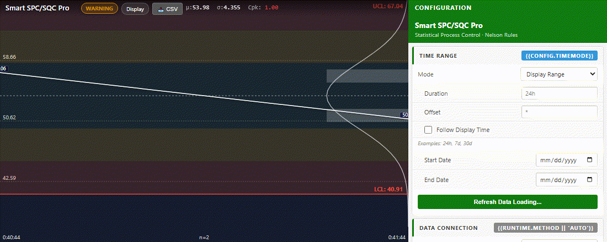
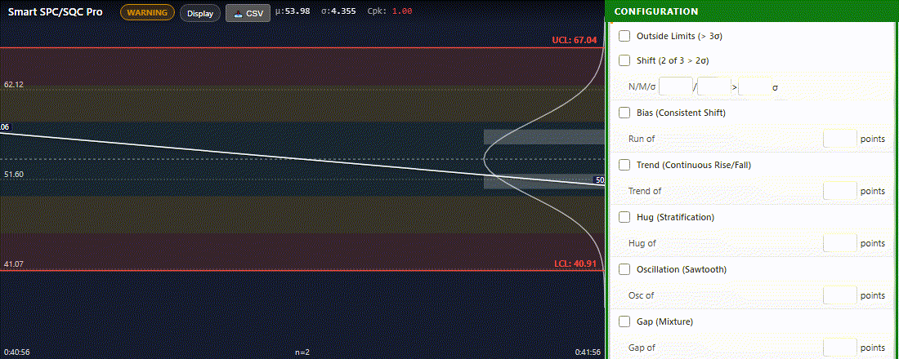
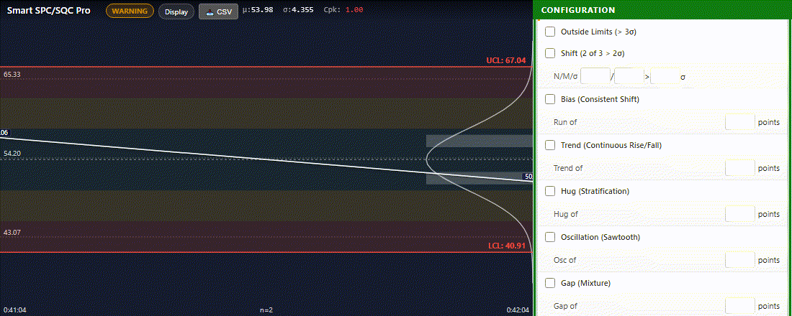
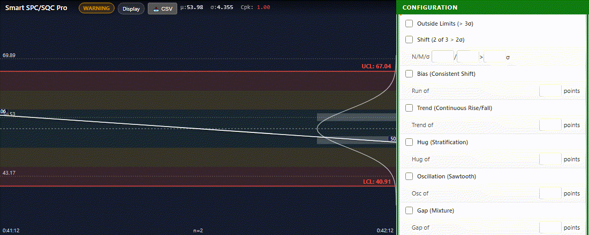
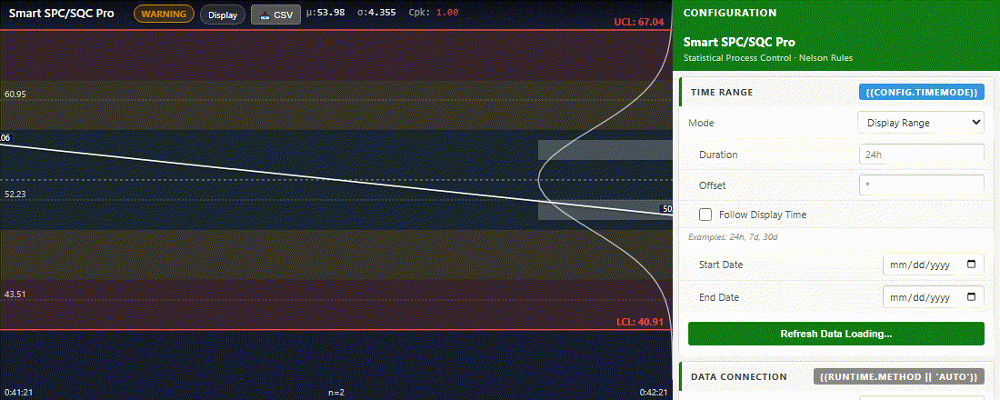
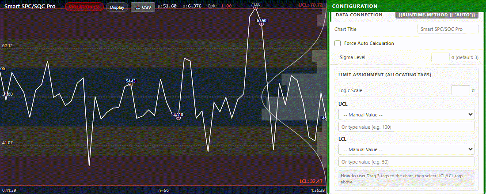
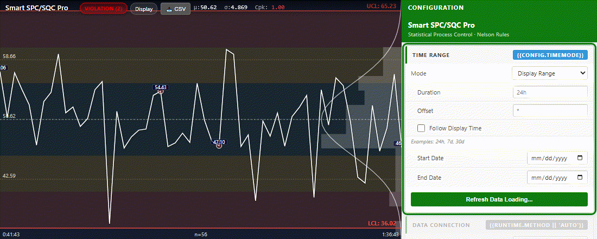
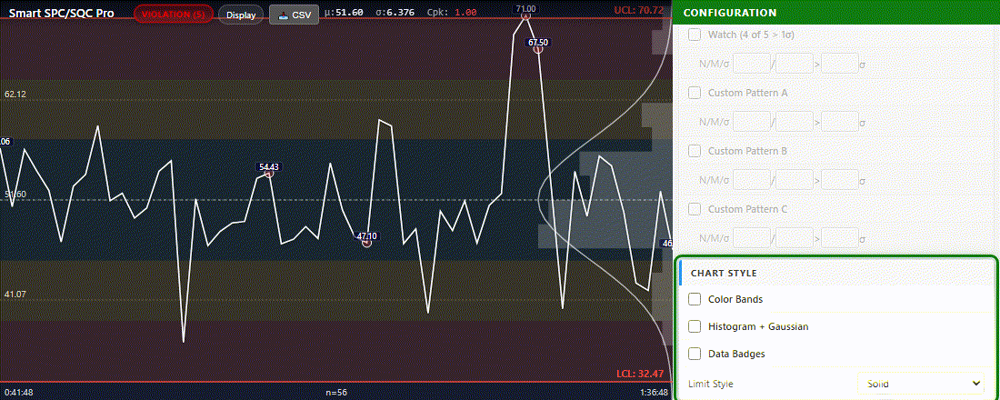
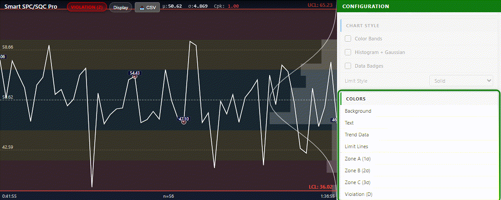

# PIForge Smart SQC Pro — Pro Edition

> Real-time SPC monitoring with zero configuration overhead

[](https://piforge.app)
[](https://piforge.app/product.html?id=8)

---

## Technical Showcase & Demo

Here is a live demonstration of **PIForge Smart SQC Pro** running in AVEVA PI Vision:

<p align="center">
  
</p>

---

## Key Features & Live Demos

Every capability is demonstrated live in AVEVA PI Vision.

### 1. Live Process Control, Always On
**Real-time SPC monitoring with zero configuration overhead**

Watch your process data stream in live — Smart SPC/SQC Pro automatically calculates control limits, detects violations, and updates the status badge the moment something goes wrong. No scripts. No external tools. Just drag, drop, and monitor.

- Auto-calculates UCL, LCL, and CL from live PI tag data
- Status badge switches STABLE → WARNING → VIOLATION in real time
- Cpk updates continuously — green when capable, red when not
- Histogram and Gaussian curve build as data arrives

<p align="center">
  
</p>

---

### 2. Rule 1 — Never Miss an Out-of-Control Point
**Instant alert when any value exceeds ±3σ**

A single rogue data point crossing your control limit is all it takes for a batch to fail. Smart SPC/SQC Pro catches it the moment it happens — marking the violation directly on the chart and raising a VIOLATION alert before your operator even notices.

- Flags any point beyond ±3σ (sigma factor is configurable: 2, 3, or 4)
- Red violation circle appears on the exact data point
- VIOLATION badge shows total count — always visible at a glance
- Cpk turns red instantly when the process goes out of control

<p align="center">
  
</p>

---

### 3. Rule 2 — Catch Process Shifts Before They Become Failures
**Detects when 2 out of 3 consecutive points exceed 2σ on the same side**

A process shift rarely announces itself with a single extreme value — it creeps in as a subtle bias. Rule 2 catches this pattern early, raising a WARNING while you still have time to act, not after the damage is done.

- Detects 2/3 consecutive points above 2σ on the same side of the mean
- WARNING badge triggers before values ever cross the control limit
- N, M, and σ threshold fully configurable to match your process standards
- Works alongside Rule 1 — multiple rules fire independently

<p align="center">
  
</p>

---

### 4. Rule 5 — Spot Trends Before They Drift Out of Control
**6 consecutive points rising or falling — a trend your process shouldn't have**

A steady upward or downward trend in your process is a warning sign that something is changing — tool wear, temperature drift, raw material shift. Rule 5 identifies the pattern while it's still within limits, giving you time to investigate and correct.

- Detects 6+ consecutive points in a continuous rise or fall
- Trend violation markers appear as the pattern completes
- Configurable run length — tighten or loosen to match your process
- Pairs with Rule 4 (Bias) for complete drift detection coverage

<p align="center">
  
</p>

---

### 5. 8 Western Electric Rules — Full Coverage Out of the Box
**Bias, Hugging, Oscillation, and Mixture patterns — all detected automatically**

Most SPC charts only check Rule 1. Smart SPC/SQC Pro runs all 8 Western Electric rules simultaneously — catching the subtle patterns that ordinary charts miss entirely. Enable the rules your process needs, disable the ones you don't.

- Rule 4 (Bias): 9 consecutive points on one side of the mean
- Rule 6 (Hugging): 15 points within ±1σ — process too quiet
- Rule 7 (Oscillation): 14 alternating up/down — systematic variation
- Rule 8 (Mixture/Gap): 8 consecutive points beyond ±1σ — bimodal distribution
- All rules configurable independently — mix and match for your standard

<p align="center">
  
</p>

---

### 6. Configurable Sigma Factor — Your Process, Your Limits
**Switch between 2σ, 3σ, and 4σ control limits without touching a formula**

Not every process runs to 3-sigma. Tighten limits to 2σ for high-precision manufacturing, or widen to 4σ for naturally noisy processes. Change the sigma factor and watch UCL, LCL, and all zone bands update instantly — no recalculation needed.

- Sigma Factor: 2σ (tight) → 3σ (standard) → 4σ (wide)
- UCL and LCL lines move in real time as you adjust
- Cpk recalculates automatically to reflect the new limits
- Manual UCL/LCL override: map limits directly from another PI tag

<p align="center">
  
</p>

---

### 7. Flexible Time Range — Display, Duration, or Custom
**Follow the PI Vision display time or pull any historical window you need**

Smart SPC/SQC Pro works in three time modes. Display mode follows your PI Vision page time automatically. Duration mode fetches a fixed rolling window — last 8 hours, last 7 days. Custom mode lets you analyze any historical period down to the minute.

- Display mode: syncs with PI Vision page time — no extra configuration
- Duration mode: 8h, 24h, 7d — configurable rolling window with optional offset
- Follow Display Time: Duration window shifts as the PI Vision time advances
- Custom mode: set exact start and end dates for historical SPC analysis

<p align="center">
  
</p>

---

### 8. Chart Style — Show Exactly What Your Operators Need
**Color bands, histogram, data badges — toggle each independently**

Every operator and every display has different needs. A control room wall screen needs a clean trend line. An engineer's workstation benefits from the full histogram and zone bands. Smart SPC/SQC Pro lets you configure exactly what's shown — and it persists per symbol.

- Color Bands: shade zones A/B/C/D (±1σ / ±2σ / ±3σ) for instant visual context
- Histogram + Gaussian curve: see your data distribution alongside the trend
- Data Badges: pin value labels on key points — first, last, and violations
- Limit Line Style: solid or dashed — adapt to your display background

<p align="center">
  
</p>

---

### 9. Full Color Control — Match Your Plant's Visual Standards
**Every color configurable — trend line, limits, zones, background**

Whether your control room uses a dark theme, a light theme, or your company's brand colors, Smart SPC/SQC Pro adapts completely. Change the trend line color, limit line color, zone band intensities, and background — all in the configuration panel, all reflected instantly.

- Trend line color: adapt to any display background
- Limit line color: high-visibility red by default, fully overridable
- Zone colors: tune the opacity of each sigma band independently
- Background and text color: dark theme, light theme, or anything in between

<p align="center">
  
</p>

---


## Installation Guide

Setting up **PIForge Smart SQC Pro** is quick and straightforward. Follow these steps:

### 1. Deploy Files to PI Vision Server
Extract the downloaded ZIP package. You will find HTML, JS, CSS/SVG, and image files. Copy these files to your PI Vision server's extension folder:
```cmd
%PIHOME%\Scripts\app\editor\symbols\ext
```
*Typically, this path translates to:*
```cmd
C:\Program Files\PIPC\PIVision\Scripts\app\editor\symbols\ext
```

### 2. Unblock Windows Files (Critical)
Windows blocks downloaded files by default. If you skip this step, the symbol will silently fail to load in PI Vision.
1. Right-click the `.js` and `.html` files you copied on the server.
2. Select **Properties** from the context menu.
3. On the **General** tab, look for the security warning at the bottom: *This file came from another computer and might be blocked to help protect this computer.*
4. Check the **Unblock** box, then click **Apply** and **OK**.
5. Repeat this for all files in the package.

### 3. License Key Activation
1. Log in to your PIForge Dashboard and go to **My Licenses** to copy your License Key (format: `XXXX-XXXX-XXXX-XXXX`).
2. Open PI Vision, add the symbol to a display.
3. Click the **Format Symbol (⚙)** configuration panel.
4. Paste your key into the **License Key** field and click **Activate**.

---

## Compatibility Reference

In PI Vision, go to **Help → About** to verify your version number.

| PI Vision Version | Smart SQC Pro Support | Notes |
| --- | --- | --- |
| **2022+** | Full Support | Recommended |
| **2021** | Full Support | |
| **2020** | Full Support | |
| **2019** | Partial Support | Some features may be limited |
| **2018 or older** | Not Supported | |

---

## Troubleshooting & Support

### Symbol does not appear in the PI Vision palette
* Verify the files are copied to the correct `ext` directory on the **PI Vision server** (not your local machine).
* Perform a hard browser refresh: `Ctrl + Shift + R`.
* Ensure all files are unblocked (see step 2 of the Installation Guide).

### Symbol loads but displays blank or shows error
* Open Browser DevTools (`F12`) and check the **Console** tab for red errors.
* Verify the license key has no extra spaces.
* Try restarting IIS on the PI Vision server. Run this command in an Administrator command prompt:
  ```cmd
  iisreset
  ```

### Need Support?
* If you run into issues, copy your license key and contact us at **contact.piforge@gmail.com** for assistance.

---

👉 **[Purchase and Download the Pro Version at piforge.app](https://piforge.app/product.html?id=8)**

*PIForge is not affiliated with AVEVA Group plc or OSIsoft LLC.*
